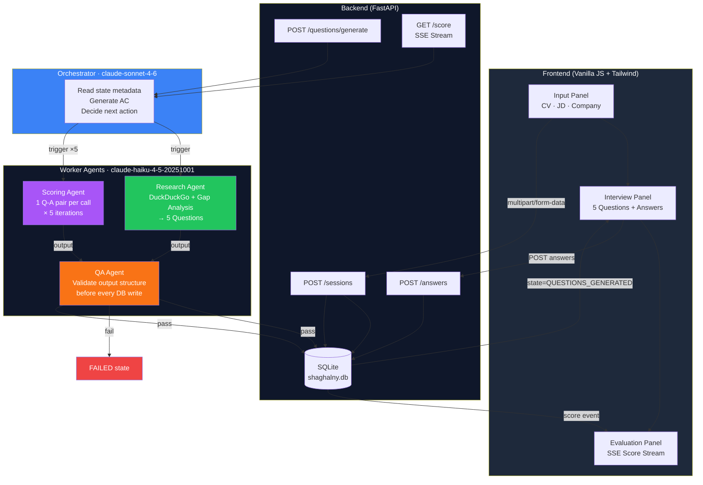
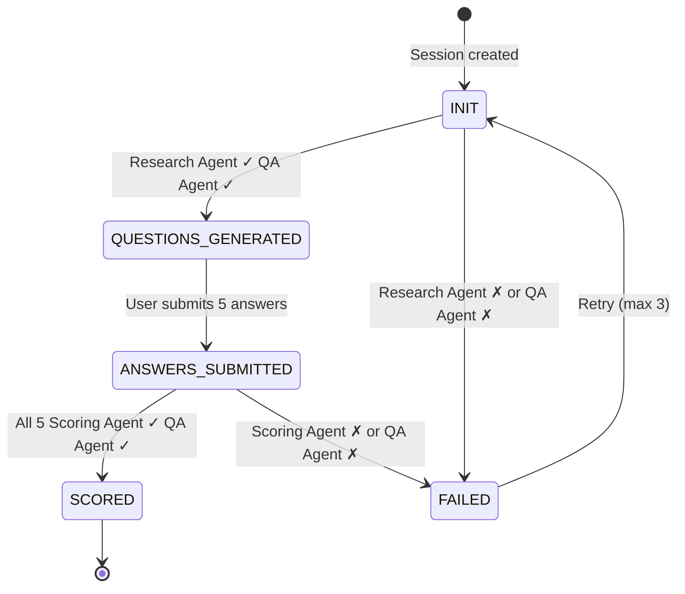
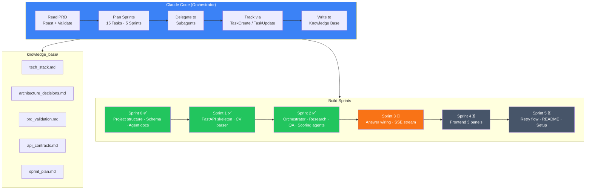

# Shaghalny — AI Interview Prep Tool

Generates the 5 hardest interview questions tailored to your CV + JD, scores your answers with structured rubric feedback.

---

## System Architecture



---

## State Machine



---

## How Claude Code Built This System



---

## Agent Model Assignment

| Agent | Model | Trigger |
|-------|-------|---------|
| Orchestrator | `claude-sonnet-4-6` | Every state transition |
| Research Agent | `claude-haiku-4-5-20251001` | INIT → QUESTIONS_GENERATED |
| Scoring Agent | `claude-haiku-4-5-20251001` | ANSWERS_SUBMITTED → SCORED (×5) |
| QA Agent | `claude-haiku-4-5-20251001` | After every worker agent output |

---

## Quick Start

```bash
cp .env.example .env
# Add ANTHROPIC_API_KEY to .env

cd backend
python3 -m pip install -r requirements.txt
uvicorn main:app --reload
# Open http://localhost:8000
```

---

## Project Structure

```
shaghalny/
├── .env.example
├── README.md
├── knowledge_base/          # Architecture decisions, ADRs, API contracts
├── agentic-workflow/        # Agent system prompt specs
│   ├── 1_orchestrator.md
│   ├── 2_research_agent.md
│   ├── 3_scoring_agent.md
│   └── 4_qa_agent.md
├── backend/
│   ├── main.py              # FastAPI app, all endpoints
│   ├── database.py          # Async SQLite helpers
│   ├── models.py            # Pydantic request/response models
│   ├── schema.sql           # DB schema
│   ├── requirements.txt
│   ├── agents/
│   │   ├── orchestrator.py  # Sonnet — state decisions
│   │   ├── research_agent.py # Haiku + DuckDuckGo
│   │   ├── scoring_agent.py  # Haiku — iterative scoring
│   │   └── qa_agent.py       # Haiku — output validation
│   └── utils/
│       └── cv_parser.py     # PDF + text extraction
└── frontend/
    ├── index.html
    ├── app.js
    └── style.css
```
